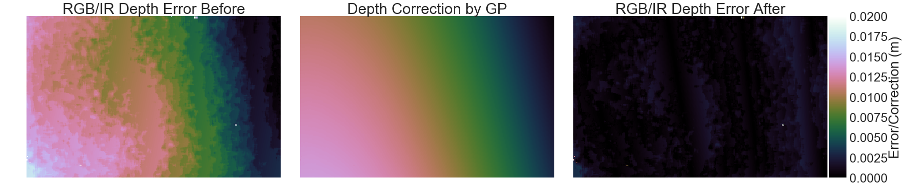

# Dense RGB-D depth correction in the spatio-thermal domain

This repository contains code and data accompanying our work on spatio-thermal depth correction of RGB-D sensors based on Gaussian Processes in real-time.



## Documentation

We provide presentation slides of the ICMV 2017 conference event

 - [PDF Slides 16:9](etc/rgbd-correction-slides-169.pdf)
 - [PDF Slides 4:3](etc/rgbd-correction-slides-43.pdf)

Our presentation was awarded the prize for ***best oral presentation of the conference***.

## Capture setup

Our capture setup consists of a RGB-D sensor looking towards a known planar object. The sensor is coupled with an electronic linear axis to adjust distance. We captured data at distances [40cm, 90cm, 10cm steps] in the temperate range of [25°C, 35°C, 1°C steps]. At each temperature/distance tuple we grabbed 50 images from both RGB and IR (aligned with RGB) sensors. We then created an artificial depth map for all RGB images utilizing the known calibration target in sight.

## Dataset

We provide two versions of our dataset
- [rgbd-correction-mini.zip](https://zenodo.org/record/6827435/files/rgbd-correction-mini.zip?download=1) ~80 MBytes | Contains mostly pre-processed mean depth images as described in our paper.
- [rgbd-correction-raw.zip](https://zenodo.org/record/6827435/files/rgbd-correction-raw.zip?download=1) ~6 GBytes | Contains the entire raw capture data, plus artificial depth maps.

Depending on your needs, you might choose one over the other. As a rule of thumb use `rgbd-correction-mini.zip` if you like to reproduce our results or play around with our code basis. Otherwise go with `rgbd-correction-raw.zip`.

*Note* As of 2022 the data has been re-packaged and uploaded to [zenodo](https://zenodo.org/record/6827435#.Ys7SkXZBwuV). See [issue #1](https://github.com/cheind/rgbd-correction/issues/1) for details.

### The `rgbd-correction-mini` version

The `.zip` has the following file structure
```
root
│   ReadMe.md                       Notes on the dataset
│   intrinsics.txt                  Intrinsic camera parameters
│   distortions.txt                 Lens distortion parameters
|   preprocessed_depth.npz          Pre-processed data in numpy format
```

The following snippet shows how to load the extracted data.

```python
import numpy as np
import sys

# Read npz file
data = np.load(sys.argv[1])    

# All temps and positions enumerated
temps = data['temps']
poses = data['poses']    

print('Temperatures {}'.format(temps))
print('Positions {}'.format(poses))

# Access pre-processed mean depth maps
all_depths_ir = data['depth_ir'][()]
all_depths_rgb = data['depth_rgb'][()]

# Index an individual depth map by position-temperature tuple
depth_ir = all_depths_ir[(poses[0], temps[0])]
print(depth_ir.shape)
```

### The `rgbd-correction-raw` version

The `.zip` has the following file structure
```
root
│   ReadMe.md                       Notes on the dataset
│   intrinsics.txt                  Intrinsic camera parameters
│   distortions.txt                 Lens distortion parameters
|   index.csv                       CSV index of all files
|   000000_t10_p0700_color.png      RGB image at t=10°C, pos=700
|   000000_t10_p0700_depth.png      IR depth image in mm
|   000000_t10_p0700_sdepth.exr     Artificial RGB float32 depth map in mm
|   000000_t10_p0700_sdepth.exr     Artificial RGB ushort16 depth map in mm
|   000000_t10_p0700_sdepth.txt     4x4 pose of calibration object w.r.t RGB
|   ...
|   007799_t35_p1200_sdepth.txt
```

The following snippet makes use of index.csv to enumerate the data quickly.

```python
import numpy as np
import pandas as pd
import sys

# Read index.csv from CLI arguments
df = pd.DataFrame.from_csv(sys.argv[1], sep=' ')

# Loop over all IR depth maps grouped by temperature
# This will give 6x50 filenames per group
groups = df[df.Type == 'depth.png'].groupby('Temp')

for t, group in groups:
    print('Processing temperature {}'.format(t))
    for n in group['Name']:
        print('  Found {}'.format(n))
```

Then use your favorite libraries to process the images.

## Code

The code contains the necessary tools to train and predict pixel-wise dense depth corrections. The CPU part contains two separate implementations, one based on `sklearn` and a minimal standalone regressor that depends on `numpy`. The GPU implementation is based on [TensorFlow](https://www.tensorflow.org/).

### Preprocessing data

If you are working with `rgbd-correction-raw.zip` you will first need to preprocess
the data by 

```
python -m sensor_correction.apps.preprocess_depth --crop 20 --unitscale 0.001 <path-to-index.csv>

Processing temperature 10
  Processing position 700
  Processing position 800
  Processing position 900
  Processing position 1000
  Processing position 1100
  Processing position 1200
Processing temperature 11
  Processing position 700
  Processing position 800
  Processing position 900
...
```

This will result in a file named `input_depths.npz` that will be used next. In case you are working with `rgbd-correction-mini.zip` you can skip this step.

### Fitting a Gaussian Process regressor

To train a GP regressor on preprocessed input data, type

```
python -m sensor_correction.apps.train input_depths.npz <path-to-intrinsics.txt>
RMSE 1.405188e-02

Optimized length scale [  2.41625833  55.406589     0.36033164  99.50966992]
Optimized signal std 0.5018155580645485
Optimized noise std 0.0316227766016838
```

The script automatically selects training data from all test data and optimizes the kernel hyper-parameters. This could take a while, be patient. Once completed a `gpr.pkl` should be generated.

### Correcting depth maps

To correct depth maps on CPU use

```
python -m sensor_correction.apps.correct_depth gpr.pkl input_depths.npz  <path-to-intrinsics.txt>
```

or for GPU accelerated computations, type

```
python -m sensor_correction.apps.correct_depth gpr.pkl input_depths.npz  <path-to-intrinsics.txt> --gpu
```

Depending on your GPU model you should be able to see a significant speed-up compared to the CPU variant. Please note that the released GPU code does not contain the final optimized instruction set and thus might run a bit slower. 

Once completed you should see a `corrected_depths.npz` file.

### Plotting results

To plot correction results, use 

```
python -m sensor_correction.apps.plot_corrected_depth input_depths.npz corrected_depths.npz
```

which should give results similar to


## Acknowledgements
This research is funded by the projects Lern4MRK (Austrian Ministry for Transport, Innovation and Technology), and AssistMe (FFG, 848653), as well as the European Union in cooperation with the State of Upper Austria within the project Investition in Wachstum und Beschäftigung (IWB).

Code and dataset created by members of [PROFACTOR Gmbh](http://www.profactor.at).

## Cite us
If you use our dataset / code in your research and would like to cite us, we suggest the following BibTeX format.

```
@InProceedings{,
 author    = {Heindl,Christoph and Poenitz, Thomas and Stuebl,Gernot and Pichler, Andreas and Scharinger, Josef},
 title     = {Spatio-thermal depth correction of {RGB-D} sensors based on {G}aussian {P}rocesses in real-time},
 booktitle = {The 10th International Conference on Machine Vision, to be published},
 year      = {2017},
 note      = {to be published},
}
```

